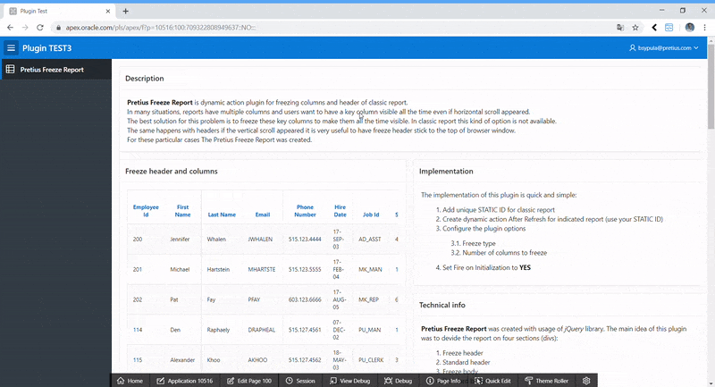

# Pretius Freeze Report

Pretius Freeze Report is dynamic action plugin for freezing columns and header of classic report.

## Information about plugin

In many situations reports have got some key columns which should be visible all the time, even if our report has got too many columns and horizontal scroll appeared. The best solution for this problem is to freeze these key columns to make them all the time visible. In classic report this kind of option is not available. The same happens with headers if the vertical scroll appeared it is very useful to have freeze header stick to the top of browser window. For these particular cases The Pretius Freeze Report was created.

## Prewiev
pretius_freeze_report.gif

## License

MIT

## Installation

Install the plugin file _dynamic_action_plugin_pretius_freeze_report.sql_

## Demo application

https://apex.oracle.com/pls/apex/f?p=10516:100:103153888436256:::::

## Usage

1. Add unique _STATIC ID_ for classic report
1. Create dynamic action _After Refresh_ for indicated report 
1. Configure the plugin options
1. Set _Fire on Initialization_ to __YES__
1. Lunch application

## About Author
Author | Github | Twitter | E-mail
-------|-------|---------|-------
Bartosz Sypuła | [@sypulabartosz](https://github.com/sypulabartosz) | [@sypulabartosz](https://twitter.com/sypulabartosz) | bsypula@pretius.com

## About Pretius
Pretius Sp. z o.o. Sp. K.

Address | Website | E-mail
--------|---------|-------
Przy Parku 2/2 Warsaw 02-384, Poland | [http://www.pretius.com](http://www.pretius.com) | [office@pretius.com](mailto:office@pretius.com)

## Support
Our plugins are free to use but in some cases you might need to contact us. We are willing to assist you but in certain circumstances you will be charged for our time spent on helping you. Please keep in mind we do our best to keep documentation up to date and we won't answer question for which there is explaination in documentation (at github and as help text in application builder).

All request (bug fix / change request) should be posted in Issues Tab at github repository.

### Free support
We do support the plugin in certain cases such as bug fixing and change request. If you have faced issue that might be bug please check Issues tab in github repository. In case you won't be able to find related issue please raise the issue following these rules:

* issue should contain login credentials to application at apex.oracle.com where issue is reproduced
* issue should contain steps to reproduce the issue in demo application
* issue should contain description about it's nature

### Paid support
In case you are not able to implement the plugin or you are willing to have custom implementation based on the plugin attributes (ie. custom JavaScript callbacks) we are willing to help you. Please send inquiry to <email> with description what you want us to help you with. We will contact you as soon as possible with pricing and possible dates.
